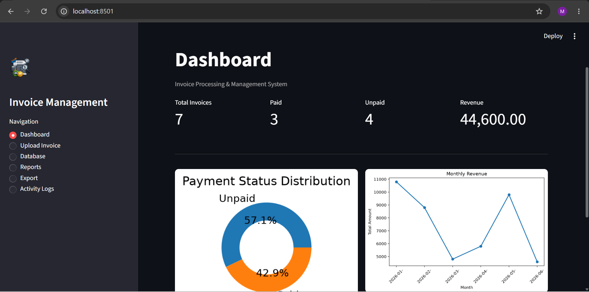

# Smart Invoice Management System

A Smart Invoice Management System built with **Python**, **Streamlit**, **SQLite**, **PyMuPDF**, **Matplotlib**, and **Docker**. The application automatically extracts invoice information from PDF files, validates the extracted data, stores it in a database, generates reports, and provides data visualization through an interactive dashboard.

---

## Features
* Upload single or multiple PDF invoices
* Automatic invoice data extraction
* Invoice data validation
* SQLite database integration
* Interactive Streamlit dashboard
* Search invoices by:
  * Invoice Number
  * Vendor Name
  * Invoice Date
* Daily invoice reports
* Monthly invoice summary
* Export data to:
  * CSV
  * Excel
  * PDF
* Activity logging
* Docker support
* Docker Compose support
* Interactive charts using Matplotlib

---

## Tech Stack

| Category             | Technology              |
| -------------------- | ----------------------- |
| Programming Language | Python                  |
| Frontend             | Streamlit               |
| Database             | SQLite                  |
| PDF Processing       | PyMuPDF                 |
| Data Analysis        | Pandas                  |
| Visualization        | Matplotlib              |
| Containerization     | Docker & Docker Compose |

---

## Project Structure

```text
Invoice-Management-System/
│
├── app.py
├── extract.py
├── validate.py
├── database.py
├── reports.py
├── export.py
├── logs.py
├── requirements.txt
├── Dockerfile
├── docker-compose.yml
├── .dockerignore
├── .gitignore
├── icon.png
└── screenshots/
```

---

## Installation

### Clone Repository

```bash
git clone https://github.com/<YOUR_USERNAME>/Invoice-Management-System.git
cd Invoice-Management-System
```

---

### Create Virtual Environment

Windows

```bash
python -m venv .invoice_management_system
.invoice_management_system\Scripts\activate
```

---

### Install Dependencies

```bash
pip install -r requirements.txt
```

---

### Run Application

```bash
streamlit run app.py
```

---

# 🐳 Docker

### Build Docker Image

```bash
docker build -t invoice-management-system .
```

### Run Docker Container

```bash
docker run -p 8501:8501 invoice-management-system
```

---

## Docker Compose

```bash
docker compose up --build
```

---

## 📊 Dashboard Features

The dashboard provides:
* Total Invoices
* Paid Invoices
* Unpaid Invoices
* Total Revenue
* Payment Status Distribution
* Monthly Revenue Analysis

---

## 📑 Reports

The system supports:
* Daily Invoice Report
* Monthly Invoice Summary

---

## 📤 Export Options

Users can export invoice data in:
* CSV
* Excel
* PDF

---

## 📷 Screenshots

### Dashboard

> Add image:

```text
screenshots/dashboard.png
```

---

### Upload Invoice

> Add image:

```text

```

---

### Reports

> Add image:

```text
screenshots/reports.png
```

---

### Export

> Add image:

```text
screenshots/export.png
```

---

## Validation

The application validates:
* Required Fields
* Duplicate Invoice Numbers
* Date Format
* Numeric Amounts

---

## Logging

The application maintains logs for:
* Uploaded Files
* Processing Success
* Validation Errors
* Processing Failures
* Export Activities

---

## 🔮 Future Improvements

* OCR support for scanned invoices
* AI-based invoice extraction using LLMs
* Authentication and User Management
* REST API integration
* Email notifications
* PostgreSQL/MySQL support
* Invoice analytics dashboard

---

## Author
**Muhammad Uzair Younas**
